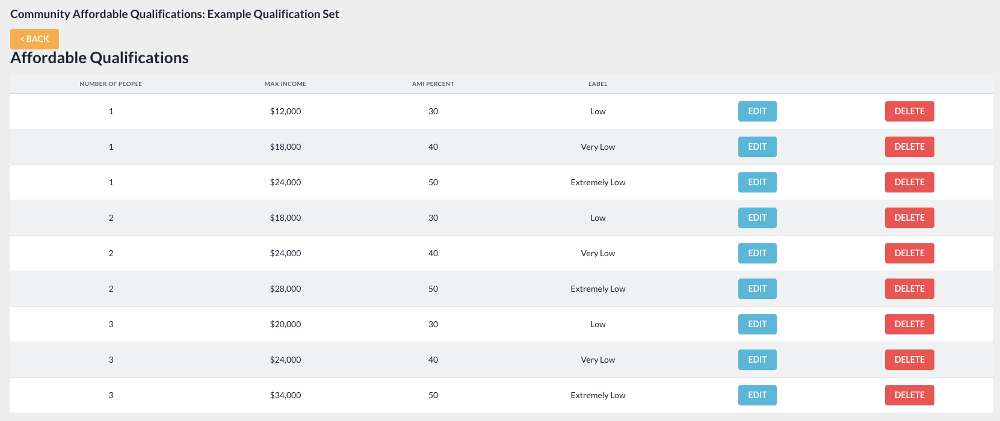

# Affordable Qualifications

The affordable qualifications application is a UI table component that displays salary limits and the amount of people in a household, so that they can receive a rent subsidy when looking to apply for a home in the community that they are interested in.


## How do we add data into this app?

Valid data is the first thing we need to provide to the application for it to work properly. The data it uses can be broken into two parts: A **qualification set**, and **qualifications.**

## Adding a Qualification Set

A qualification set can be added within the CMS, (in the left navigation) Community Info => Edit Affordable Qualifications. Once on the Edit page, you will be met with either an empty table, or one full with previously created sets. In addition a form appears below the table, which allows you to input data and create Qualification Sets to add to the table above.


Within the table you can see a snapshot summary about the set such as, Name, Header, and Description. Name is an internal value which the front end will not receive, while the Header and Description are two values which will appear on the front end. 

When creating a set, only the Name field is technically required, however, if no Header or Description were added, the front end table will **NOT** appear on the front end. In addition a set can be enabled, disabled, edited, deleted, one can also add qualifications.

If a set is marked as enabled, it means that this is the set that will appear on the front end website. Only one set can be enabled at a time, but all sets can be disabled at the same time. If a set you want enabled is currently disabled, simple click enable, and all other sets will be set to disabled, and the set you clicked will become enabled. 

Finally, if all sets are disabled, nothing will appear on the front end. To add qualifications to a qualification set, click on “View Details” of the set you want to add to. See more details on how qualifications are added below.

## Adding Qualifications to a Qualification Set

Upon clicking “View Details” within the corresponding row of the Qualification Set you want to add to, you will be met with yet another Table, followed by a form below. The first four columns of the table will be rendered onto the front end of the website, along with the ability to edit and delete specific qualifications.

### Data Reference
The fields on the form accept the following data types:

-   AMI Percent = Integer
    
-   Number of People = Integer
    
-   Max Income = Integer
    
-   Label = String

### Notes regarding data input

-   Integers do not need to be given symbols such as % or $, as that will be added in with JavaScript when the page loads.
    
-   If you do not need to add in an AMI Percent, you can provide a value of 0.
    
-   The Label is the heading that the Max Income column will receive. If you do not provide a value for the Label field, the default heading when the page loads will be “Annual Household Income”


After filling out the form a couple times and when your table is full of the required date, congratulations, thats all!



Your qualifications have automatically been saved, you can now click the back button to return to the Edit Qualification Sets page to double check that everything looks right. 

**Please Remember to make sure that the desired Qualification Set is “enabled”, other wise you won’t see anything on the front end, or you might be displaying an unwanted Qualification Set if another is enabled.** 

When you are ready, it’s time to add a snippet to finalize displaying of the application.

## Adding the app code to your website

This application can be added to any page on a website. To do so, simply copy the root div into the section of the HTML desired, while the script tag added in as extra js within that page.

### Additional attributes that can be added
- data-custom-house-hold-title

```
<div id="affordable_qualifications"></div>
<script src="{{ STATIC_URL }}js/affordable-qualifications/dist/main.min.js" defer></script>

// With the custom title data attr
<div id="affordable_qualifications" data-custom-house-hold-title="This is a custom title"></div>
```

Here is an example of placing it at the bottom of the Breeze demo home page


## Front End Customization
As of right now, the completed table on the front end defaults to the blue that the Breeze them uses. To change 
colors, a site builder will need to inspect where the color is set, and simply overwrite within their scss file.


## Need Help?
If you meet any problems getting this to work the way the task intends, tag either Andrew or Chris in [#dev_help](https://apartments247.slack.com/archives/CV7JU5B36)