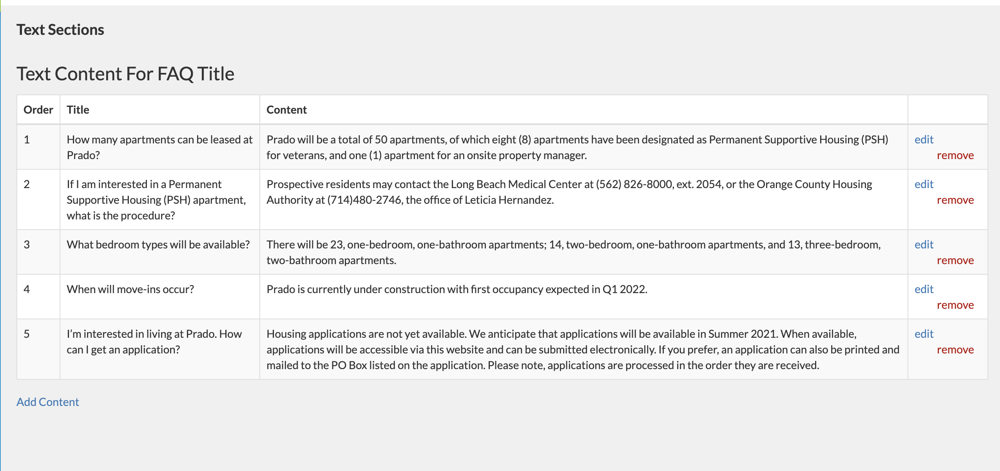

# Text Sections

The Text Sections app is a feature that provides our team two methods for adding FAQ and Overview sections OR whole pages to our client's website's.

  

## How It Works

To get the Text Sections app working correctly, it requires data from the cms, as well as two methods of providing it to the frontend as either a **section**, or a **page**, depending on the requirement of your given task.

  

### Customer Data

Per workflow, data will have already been entered, however, steps for this will be summarized below so that you may troubleshoot should issues arise.

  

Text Section can be entered within the CMS (Website Content => Text Sections => Add/Edit Text Section(s)).

  

#### Adding a Text Section

Clicking Add Text Section will bring you to a form where you can create a Title and choose a Section Type. Details for these two provided below:
- **Title**: This will be the header that site visitors will see above whatever content you need to add for this section.
- **Section Type**: This field will be a dropdown consisting of, Community Overview, FAQ, and Custom. Choosing the section type does just that, creates a section for either Overview (header and paragraph(s)), or FAQ. **If custom is desired, read on to learn more about that.**


#### Custom Section Types
Choosing a custom type will bring you to a more customizable section form. Instead of simply having a field for Title and Section Type, it will consist of a Title, Anchor Tag, Div ID, Render As, and a checkbox for "Visibility". Details for these fields are provided below:
- **Title**: This will be the header that site visitors will see above whatever content you need to add for this section.
- **Anchor Tag**: The content provided here will be just that, an anchor tag that attaches to the section container we ever need to link to that section!
- **Div ID**: One of the most important pieces of data to get the app functioning correctly. The value here will be fed to the div that wraps around your created text section. **Please note, whatever ID is provided here, must match with the div id of where you intend to render this text section. More on this later.**
- **Render As**: This will be a dropdown section. Currently, you may choose between "Paragraphs" and "Description List", which translate to Overview and FAQ sections, respectively. Example, If I create a text section with a Render As set to Description List, you can expect the created text section to be an faq section, as pictured below.


  
#### Editing a Text Section/Adding Content to Text Section
Upon creating your text section, you will then be redirected to a table that lists out all of the text sections created. Here you will be able to Edit Content (add content to the text sections), or Remove the text section entirely along with its content. 


Clicking on the edit content will bring you to another form where you can then click on a button called Add Content, which leads to, wait for it, yet another form. This form consists of an optional Title, a Content body , as well as an order placement, referring to the order of the content when it renders to the frontend. 


   

### Getting Data to the Frontend
Created Text Sections can actually be added as a section within a page or as a page itself (FAQ or About pages, as examples).

#### As a Section Within a Page
To add your created section to a specific page on the website, simply add the snippet below to the required page. Some notes regarding this method:
- the below example is for the Breeze theme, your theme may use different blocks.
- if the section type you chose when creating the section was either FAQ or Overview, the root div id's have a "Default" value of faq-container and community-overview-container respectively.
- if your section type was custom, you will need to provide your root div with whatever div id you provided when creating your section.

"Default" Snippet Example - contains both the Overview and FAQ sections on the same page, however, you may use only one if desired.
```

	{{ block.super }}
	<div id="overview"></div>
	<div id="faq"></div>



	{{ block.super }}
	<script src="{{ STATIC_URL }}js/text_sections/dist/main.min.js" defer></script>

```

If you chose a custom section type the ids within the divs would need to match whichever id you provided.

```

	{{ block.super }}
	<div id="custom_id_1"></div> // Again, the id here should match the id you created.
	<div id="custom_id_2"></div>



	{{ block.super }}
	<script src="{{ STATIC_URL }}js/text_sections/dist/main.min.js" defer></script>

```

#### As a Page
If you were tasked to create a page for the site dedicated to either FAQ or Overview for example, you would create a page like normal in the cms by creating a route. You would then provide the index.html file there with the following:
```


faq
```

_text_sections.html has the following block within:
```

	{{ block.super }}
	
		<div  id="overview"></div>
	

```
The block "block text_section_id" allows you to overwrite the root id with either default ids or custom created div ids. For example, if you created an FAQ section and you provided a custom div id of custom_id, you would simply overwrite the id with the "block text_section_id" block like in the first snippet in this section.

  

***

Here is an example of how the following sections should look once all the above steps have been completed


  

## Troubleshooting Notes

The most common problem regarding this application will most likely be matching your created div id with the div id you provide to the frontend. Please note that whichever div id you supplied when creating your div id is viewable within the Edit Section page so that you are able to correctly match your id's.

If there are any problems, please reach out to [#dev_help](https://apartments247.slack.com/archives/CV7JU5B36) for more help.