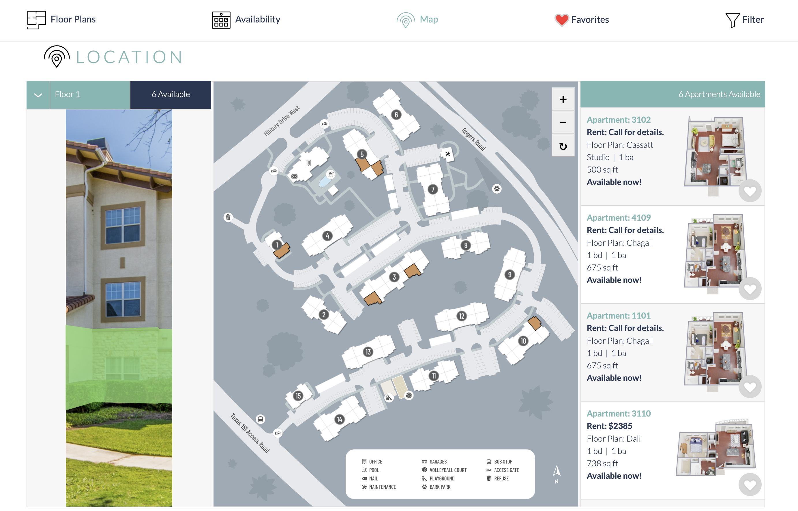
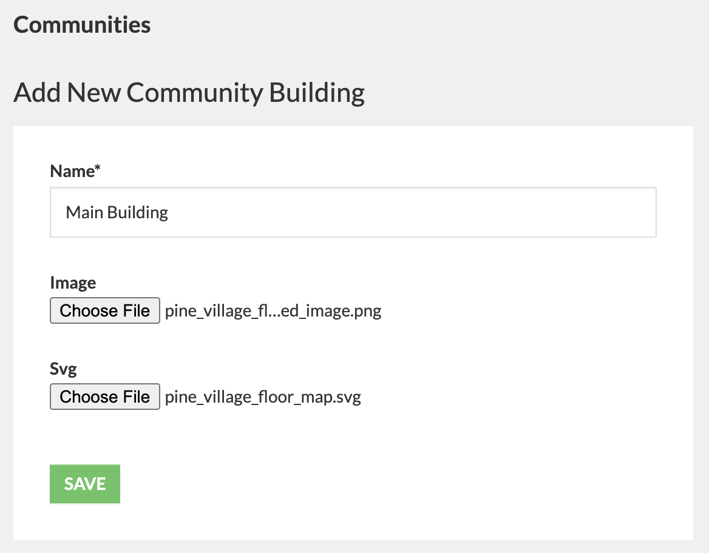
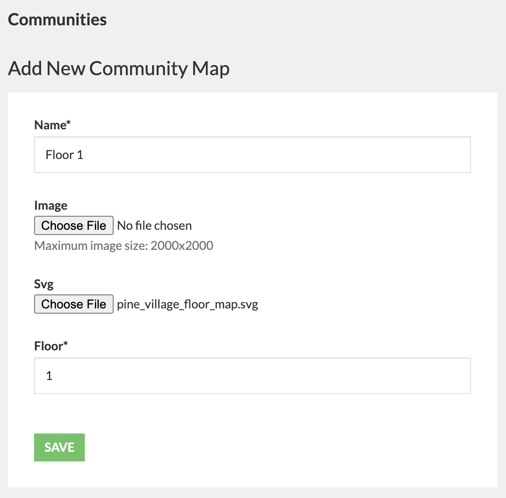
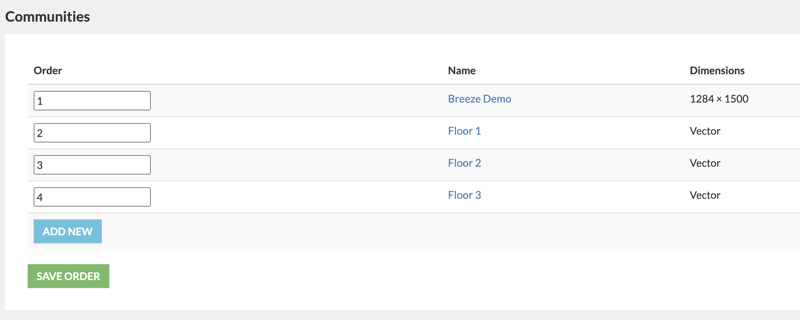
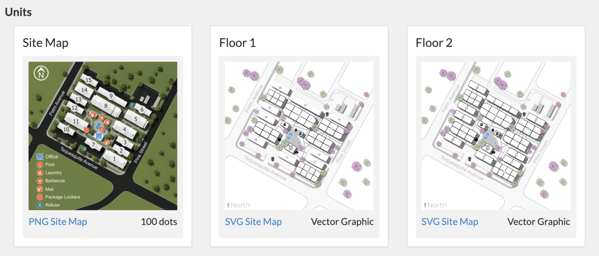
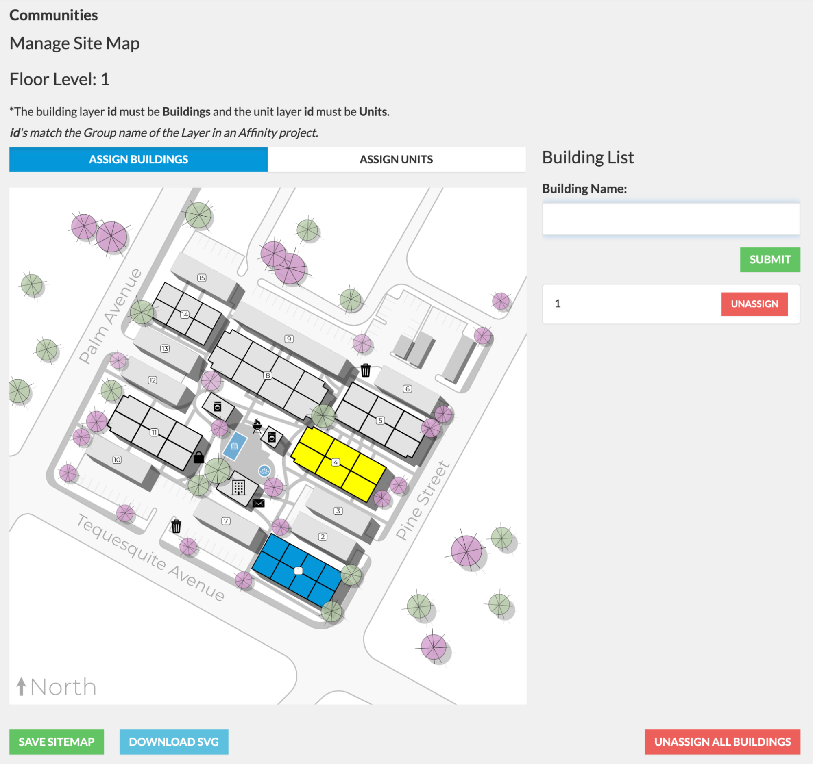

# SVG Site Map Application

This is both a CMS and front end website application. On the CMS side, the user will be uploading PNGs and SVGs, and assigning buildings and housing units on top of the uploaded images. 

The front end will receive the uploaded SVG maps, as well as display the available units, represented by colored shapes, allowing the user to click these available units on the map, to reveal details of the chosen unit. 

In addition, the user will be able to use the building image that was uploaded previously, to select which floor level they’d like to view for availability.

Here is the final front end product:



### This app can be divided into the following components:

-   Floor Level Building
    
-   SVG Site Maps
    
-   Building Assignment
    
-   Unit Assignment

## Floor Level Building
This section is where you will upload an image of a building within the community you are currently working on, as well as an SVG that will be layered over the building image on the front end, allowing the map to become clickable so that the user can select available units on a specific floor. 

### How to get there
Within the CMS in the left navigation menu, you will head over to Website Content => Buildings => Add Building. 

### What to do when you get there
Here you will be met with a form with fields asking for a Name, a PNG uploader, and an SVG uploader. The name will be an internal tool and so will **NOT** be displayed in the front end. The png should be an image of the building, while the SVG will be a layer mask. Here is an example of a filled in form.




## SVG Site Maps
In this section you will be uploading SVGs representing the community map so that can we start assigning buildings to sections of the map, and later we can assign units to buildings. 

### How to get there
Within the CMS in the left navigation menu, head over to Website Content => Maps => Add Map. 

### What to do when you get there
Here you will be met with a form with fields asking for a Name, a PNG uploader, Alt Text, an SVG uploader, and Floor. 

For the purposes of this app, we can disregard the PNG uploader. Let's take a closer look at the Name and Floor fields, Considering that the SVG uploader and Alt Text field are relatively self explanatory. 

- **Name:** The convention that should be used here is: Floor 1, as an example. Upon filling out the form for the next floor, logically the next name would be, Floor 2, and so on. If the building has sub parking floors, they should be named Parking 1, Parking 2 and so forth. If the building has a roof top layer, that needs to include the word "roof", for example Rooftop or Roof Level.
- **Floor:** The floor field should accept an integer. If the Name of the current floor you are working on is **Floor 1**, then the Floor field in this case should be 1. If Name = Floor 2, then the Floor field should be 2, and so on. If the floor is a sub level it should be -1, -2, and so forth.

This form will be filled out as many times as how many floors a community has, **clicking the save button after each completion** of course. Here is an example of a filled out form:




### Editing an SVG Site Map
If you head over to Website Content => Maps => Edit Map, you will see a table of successfully added Site Map uploads. If any edits need to be made, simply click on the name of the Map you want to edit in the Name column of the table.




## Building Assignment
Upon completing the Site Map uploads, it's time to start assigning Buildings.

### How to get there
Within the CMS in the left navigation menu, head over to Website Content => Units => Manage Red Dots & SVG Paths. This will bring you to a page where you will be able to view all the SVG maps you uploaded in the previous step, as well as their Name. Click on the first floor.




### What to do when you get there
You will be brought to a page with two tabs: **Assign Units** and **Assign Buildings.** Click on Assign Buildings for now. 

On the map, a building is represented by a group of units (which are represented by small shapes), with a number in the middle of the grouped units. 

To assign a building, simply click on one of the sets of grouped units, which will then highlight that group. Once highlighted, you can head over to the Building Name field, provide a name, and then click Submit. Doing so will assign that building name (represented by a new entry in the list of assigned buildings) and permanently highlight the building on the map. You may then do the same for the other currently unassigned buildings. 

If a mistake was made in any way and you need to edit a building assignment, you will first need to unassign that building, and assign it again.

**Note: Please remember to SAVE your work using the green Save Site Map button in the bottom left of your screen before moving on to another page of the CMS!**

Here is an example of a couple of assigned buildings:



**The above steps will need to be repeated for each floor created in the previous section**


## Unit Assignment
The last portion of the CMS side for this app will be to assign Units. Completing this will allow users on the **website** to view all available units for their corresponding floor, as well as more details about that unit!

### How to get there

This section will use the same path you followed to get to the Building Assignment section (Website Content => Units => Manage Red Dots & SVG Paths), however this time you will click on the **Assign Units tab**.

In this section, you have two options that can be used by selecting either of the tabs to the right: **Assign Single Unit** and **Assign All Units**. 


**Note**: 
- On the map, assigned units will be represented by a highlighted color, while unassigned units will be grey.
- In the list, assigned units will have a blue background, and unassigned units will have a white background. 

***

### Assign All Units
The assign all units feature will be covered first, since that is most likely the feature that will be used first. 

#### Bulk Assign
Clicking on the "Start Bulk Assign" button will bring you into "Bulk Assign mode", which will allow you to click on units not currently highlighted within the map, and after every click, the next currently unassigned unit within the unit list will be assigned to the clicked unit on the map. 


If you'd like to Stop bulk assign mode, then simply click the Stop Bulk Assign button. When NOT in bulk assign mode, you are able assign a map unit to a list unit by first clicking the unit on the map, which will highlight the clicked unit in yellow, then head over to the list of units, and click the "Assign" button. If successful the unit you selected on the map should change to purple. This is a good method if a mistake was made when assigning a unit during bulk assign. 


#### Other Features
Using the buttons within the unit list, you are also able to:

- Highlight currently assigned units
- Unassign currently assigned units


***


### Assign Single Unit
When you need to **search** for a unit that needs to be assigned, this feature can be used instead. 

Locate the unit on the SVG site map and click the unit to select it. Once selected, use the autocomplete search to set the unit to the selected svg path. Search by Unit Number or Unit ID. To re-assign a unit, first unassign it, then re-assign it.

**Note: Please remember to SAVE your work using the green Save Site Map button in the bottom left of your screen before moving on to another page of the CMS!**

**The above steps will need to be repeated for each floor created in the previous section**

## Adding the front end application to a website
Once the CMS side is taken care of, it's time to add the app code snippet to a page on the front end. Once you have identified the page you want to add to, simply add the snippet below, this example will also include the Django template tags:

```



const floorPlansOne = new FloorPlansOneApp();
floorPlansOne.initialize();

```

### Customization
The application also has customization settings that a builder can use to overwrite the default settings. Here are the current default settings:

```
{
    activeColor: "rgb(30,144,255)",
    animateDuration: "1s",
    animateFromColor: "rgb(230,0,0)",
    animateToColor: "rgb(255,51,51)",
    buildingActiveColor: "fill:rgb(145,227,115);fill-opacity:0.75;cursor:pointer;",
    buildingHoverColor: "fill:rgb(120,245,74);fill-opacity:0.75;cursor:pointer;",
    buildingInactiveColor: "fill:rgb(255,0,27);fill-opacity:0;cursor:pointer;",
    favoriteAmenityIcons: false,
    seoHeaderText: false,
    zoomAndResetControls: true
  }
```

Now to overwrite any of these settings, simply pass in an object with the key(s) you are targeting, as well as its new value. Here is an example:

```



const floorPlansOne = new FloorPlansOneApp({
    seoHeaderText: true,
    animateToColor: "rgb(255,255,255)"
});
floorPlansOne.initialize();

```

Here is an example of what this snippet renders to the front end:


## Troubleshooting Notes

### Assigning Buildings
-   If a building can not be clicked, either it’s path was not set correctly in the SVG creation process or the layer Group where the building paths reside is named incorrectly. The layer Group must be named **Buildings**. Affinity exports the layer Group name as the **id** in the SVG HTML, this id in the SVG HTML is targeted to initialize the web apps and therefore must be named **Buildings**. (other programs may set the **id** differently).

### Assigning Units
-   If the unit autocomplete does not show the unit it is possible the unit was not entered into the CMS prior.
- If a unit can not be clicked, either it’s path was not set correctly in the SVG creation process or the layer Group where the building paths reside is named incorrectly. The layer Group must be named **Units**. Affinity exports the layer Group name as the **id** in the SVG HTML, this id in the SVG HTML is targeted to initialize the web apps and therefore must be named **Units**. (other programs may set the **id** differently).

### Need Help?
If you meet any problems getting this to work the way the task intends, tag either Andrew or Chris in [#dev_help](https://apartments247.slack.com/archives/CV7JU5B36)
